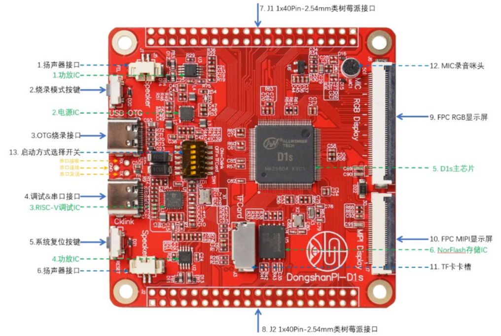
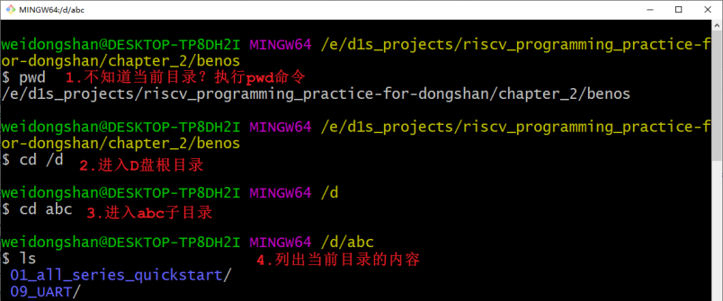
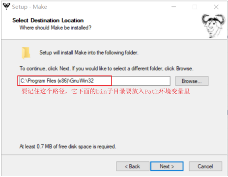
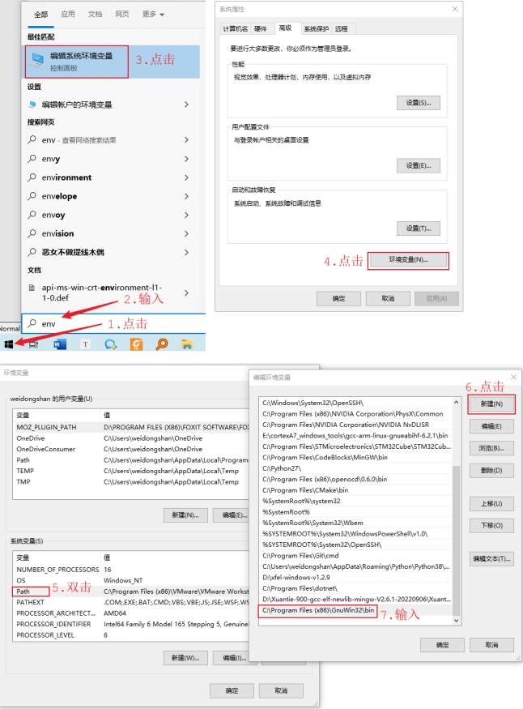
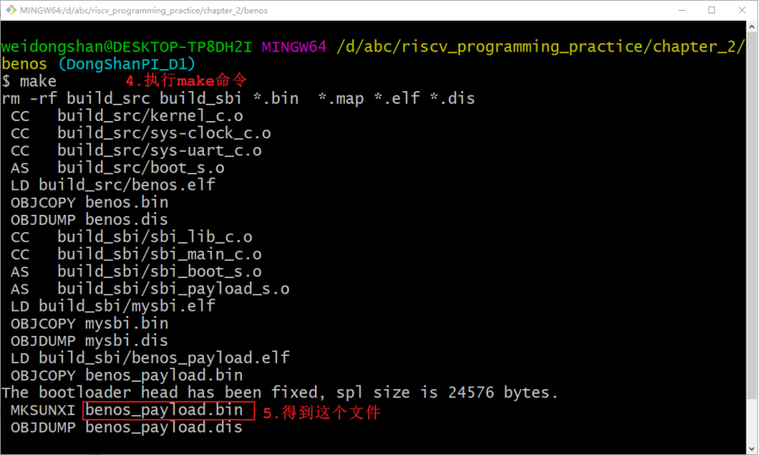
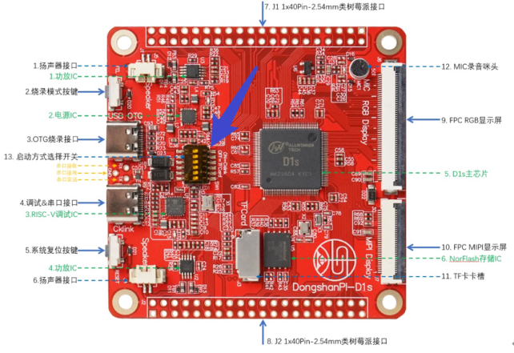
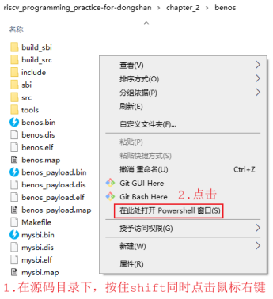

[toc]


# 第1章 环境搭建

## 1.1 开发板介绍

笨叔编写的《RISC-V体系结构编程与实践》，里面的源码是基于QEMU模拟器的，可以认为它是一款虚拟的开发板。如果需要在真实开发板上学习，可以使用百问网的DongshanPI-D1S开发板。

DongshanPI-D1S是百问网推出的一款基于RISC-V 架构的学习裸机、RTOS的最小开发板。集成CKLink调试器，支持OTG烧录、GDB调试、串口打印，并将主芯片所有的信号全部引出，其中左右两侧兼容了树莓派的电源信号定义，可以很方便扩展模块。

D1S是全志公司针对智能解码市场推出的高性价比AIoT芯片，它使用阿里平头哥的64bit RISC-V架构的C906处理器，内置了64M DDR2，支持FreeRTOS、RT-Thread等RTOS，也支持Linux系统。同时集成了大量自研的音视频编解码相关IP，可以支持H.265、H.264、MPEG-1/2/4、JPEG等全格式视频解码，支持ADC、DAC、12S、PCM、DMIC、OWA等多种音频接口,可以广泛应用于智能家居面板、智能商显、工业控制、车载等产品。




板子资料：http://download.100ask.net/boards/Allwinner/D1s/index.html

购买地址：https://item.taobao.com/item.htm?id=688098912622


## 1.2 下载资料

资料分两部分：开发板通用资料、《RISC-V体系结构编程与实践》的D1S源码。前者比较庞大，放在百度网盘；后者放在书籍配套的GITEE网站。

 

开发板通用资料：

打开http://download.100ask.net/boards/Allwinner/D1s/index.html，可以看到“D1s课程配套通用资料”对应的百度网盘地址，请自行下载。本课程主要使用下图所示的软件：


《RISC-V体系结构编程与实践》的D1S源码：

打开https://gitee.com/weidongshan/riscv_programming_practice，登录后按如下界面操作：


点击“克隆/下载”按钮之后，如下点击“下载ZIP”即可：


如果你没有点击“下载ZIP”，而是使用GIT命令来下载，那么下载成功后还需要执行如下命令：

```
git checkout DongShanPI_D1
```


## 1.3 安装软件

需要安装如下5个软件，它们都位于网盘资料“开发板通用资料\05_开发配套工具\”目录下：

① “Git\Git-2.39.1-64-bit.exe”：我们把它当做命令行，不能使用Windows自带的DOS命令行、Powershell（在里面无法执行make命令）

② “make\make-3.81.exe”：make工具

③ “toolchain\Xuantie-900-gcc-elf-newlib-mingw-V2.6.1-gdbtui-20230210.tar.gz”：这是Windows版本的交叉编译工具，并且支持TUI

④ “CKLinkServer\T-Head-DebugServer-windows-V5.16.6-20221102-1510.zip”：这是调试服务软件

⑤ “xfe\xfe.exe”：烧写工具

 

### 1.3.1 Git Bash

双击“开发板通用资料\05_开发配套工具\Git\Git-2.39.1-64-bit.exe”即可安装。

启动Git Bash有两种方法：

① 点击“开始->Git->Git Bash”

② 在文件浏览器进入某个目录后，在空白处点击右键弹出菜单后选择“Git Bash Here”

在Git Bash中各种命令的用法跟Linux完全一样，比如也有“cd”、“ls”、“rm”等命令。在Git Bash中，对路径的表示方法也跟Linux一样，比如D盘下的abc子目录使用“/d/abc”表示，而不是“D:\abc”。

在Git Bash中使用命令简单示范如下：




### 1.3.2 make

双击“开发板通用资料\05_开发配套工具\make\make-3.81.exe”即可安装。安装时，要记住安装的路径，需要把安装路径下的bin目录放入环境变量Path里。



如下图把“C:\Program Files (x86)\GnuWin32\bin”添加进环境变量Path：



验证：启动Git Bash后执行“make -v”命令，如下图所示。


### 1.3.3 交叉工具链

把“开发板通用资料\05_开发配套工具\toolchain\Xuantie-900-gcc-elf-newlib-mingw-V2.6.1-gdbtui-20230210.tar.gz”解压即可，注意路径名不要有中文。

解压后要确认如下目录里的文件不是0字节：


使用有些解压工具比如banzip可能会得到0字节的文件，建议使用7-Zip解压。

解压成功后，可以看到“riscv64-unknown-elf-gcc.exe”文件，如下图所示：


需要把“riscv64-unknown-elf-gcc.exe”文件所在目录放入Path环境变量里，具体方法可以参考《1.3.2 make》。结果如下图所示：


验证：启动Git Bash后执行“riscv64-unknown-elf-gcc -v”命令，如下图所示（Git Bash支持命令补全功能，输入“risc”后按TAB键会自动补全命令）。


### 1.3.4 调试服务软件

先解压文件：“开发板通用资料\05_开发配套工具\CKLinkServer\T-Head-DebugServer-windows-V5.16.6-20221102-1510.zip”。

再双击里面的“setup.exe”即可安装。

 

### 1.3.5 烧写工具

把“开发板通用资料\05_开发配套工具\xfel”目录复制到其他非中文路径即可。

还需要把“xfel.exe”文件所在目录放入Path环境变量里，具体方法可以参考《1.3.2 make》。结果如下图所示：


验证：启动Git Bash后执行“xfel --help”命令，如下图所示。


## 1.4 安装驱动

DongshanPI-D1S开发板各接口如下图所示：


D1S自身支持USB-OTG烧录（对应上面的接口“3.OTG烧录接口”），这需要安装对应的驱动程序。

DongshanPI-D1S开发板集成了CKLink调试器（对应上面的接口“4.调试&串口接口”），它有2个功能：调试、USB串口，需要安装2个驱动程序。


### 1.4.1 OTG烧录驱动程序

使用USB线连接开发板的“3.OTG烧录接口”到电脑后，先按住“2.烧录模式按键”不松开，然后按下、松开“5.系统复位按键”，最后松开“2.烧录模式按键”，开发板就会进入烧录模式。

第一次使用烧录模式时，要先安装驱动程序，先运行程序“开发板通用资料\05_开发配套工具\xfel\Drivers\zadig-2.7.exe”，然后如下图操作：


 

注意：上图的第4步里，按钮内容可能是“Install Driver”、“Replace Driver”或“Reinstall Driver”,都一样点击。

 

 

验证：安装好驱动程序后，使用按钮让板子进入烧录模式，然后在Git Bash中执行命令，可以检测到设备：


如果没找到设备，可以多次尝试：

① 使用按钮让开发板进入烧录模式

② 重新安装驱动、甚至重启电脑

③ 插到电脑的其他USB口

 

### 1.4.2 USB串口和调试器

使用USB线连接开发板的“4.调试&串口接口”到电脑后，它会自动安装2个驱动程序，打开设备管理器可以看到如下设备：


# 第2章 体验第一个程序

## 2.1 编译烧录运行

### 2.1.1  编译

先进入源码目录，打开Git Bash，如下图操作：


然后在Git Bash中执行“make”命令，可以生成benos_payload.bin文件，如下图所示：




### 2.1.2 烧录运行

使用2条USB线，分别连接开发板的“3.OTG烧录接口”、“4.调试&串口接口”，使用串口工具打开串口，波特率设为115200,8个数据位，1个停止位，不使用流量控制。

烧录方法如下：

① 先让开发板进入烧录模式：

方法为：先按住“2.烧录模式按键”不松开，然后按下、松开“5.系统复位按键”，最后松开“2.烧录模式按键”。

② 然后在Git Bash开执行“make burn”命令

如下图所示：


烧写成功后，按下、松开“5.系统复位按键”即可启动程序，可以在串口看到输出信息：


## 2.2 调试

### 2.2.1  GDB常用命令

使用GDB调试时，涉及两个软件：

① 在Git Bash中运行的“riscv64-unknown-elf-gdb”：它发出各类调试命令，比如连接调试服务软件(T-HeadDebugServer)、单步运行、查看变量等等

② T-HeadDebugServer：它就是“调试服务软件”，负责接收、处理各类调试命令

 

常见的命令如下表所示：

| **命令**          | **简写形式** | **说明**                                                     |
| ----------------- | ------------ | ------------------------------------------------------------ |
| target            |              | 连接调试服务器，比如：   target remote 127.0.0.1:1025        |
| run               | r            | 运行程序                                                     |
| continue          | c、cont      | 继续运行                                                     |
| break             | b            | 设置断点，比如：   b sbi_main.c:121  b sbi_main  b \*0x20000 |
| delete            | d            | 删除断点                                                     |
| disable           | dis          | 禁用断点                                                     |
| info  breakpoints | info b       | 显示断点信息                                                 |
| next              | n            | 执行下一行                                                   |
| nexti             | ni           | 执行下一行（以汇编代码为单位）                               |
| step              | s            | 一次执行一行，包括函数内部                                   |
| setpi             | si           | 执行下一行                                                   |
| list              | l            | 显示函数或行                                                 |
| print             | p            | 显示表达式，比如：   print a  print $pc // 打印寄存器  print \*0x20000//打印内存  print /x a // 16进制打印 |
| x                 |              | 显示内存内容，比如：  x 0x20000  x /x 0x20000 //16进制       |
| info  registers   | infor  r     | 打印所有寄存器的值                                           |
| set               |              | 设置变量，比如：  set var a=1  set \*(unsigned int \*)0x28000 = 0x55555555  set var $pc=0x22000 |
| finish            |              | 运行到函数结束                                               |
| help              | h            | 显示帮助一览                                                 |
| backtrace         | bt、where    | 显示 backtrace                                               |
| symbol-file       |              | 加载符号表，比如  symbol-file benos.elf                      |


### 2.2.2 benos_payload程序组成

《RISC-V体系结构编程与实践》中的代码分为两部分：

① mysbi.elf：运行于M模式的底层软件，提供各种系统服务

② benos.elf：运行于S模式的应用软件

benos_payload是这两部分程序的组合：


### 2.2.2 benos_payload程序组成

《RISC-V体系结构编程与实践》中的代码分为两部分：

① mysbi.elf：运行于M模式的底层软件，提供各种系统服务

② benos.elf：运行于S模式的应用软件

benos_payload是这两部分程序的组合：

```
benos_payload.elf = mysbi.elf + benos.elf
benos_payload.bin = mysbi.bin + benos.bin
```

烧写、运行benos_payload.bin时，会先运行mysbi程序，mysbi再启动benos。调试benos_payload.elf时，我们可以先调试mysbi，等benos启动后再调试benos。


### 2.2.3 调试准备工作

首先，启动CKLink的调试功能，方法为：把下图中蓝色箭头所指的拨码开关上的薄膜撕开，把所有拨码开关拨向左边(USB接口那边)：



然后，启动调试服务软件“T-HeadDebugServer”，它会自动检测到芯片，如下图所示：


如果没有上图所示信息，有多种可能：

① 没有自动识别：

可以手动识别，如下图所示：


② 板子上的程序有Bug，导致板子死机了：可以让板子先进入烧录模式，再按照步骤①操作

③ 提示1025端口被占用：运行任务管理器，把所有“T-HeadDebugServer”杀掉，再重新运行“T-HeadDebugServer”

 

当“T-HeadDebugServer”识别出芯片后，就可以调试程序了，有2种方式：

① 使用命令行模式调试

② 使用TUI模式调试


### 2.2.4 命令行调试示例

当“T-HeadDebugServer”识别出芯片后，就可以在Git Bash里执行“riscv64-unknown-elf-gdb  benos_payload.elf”来调试程序了。

示例如下：

```
weidongshan@DESKTOP-TP8DH2I MINGW64 /d/abc/riscv_programming_practice/chapter_2/benos (DongShanPI_D1)
$ riscv64-unknown-elf-gdb benos_payload.elf
Reading symbols from benos_payload.elf...
(gdb) target remote 127.0.0.1:1025       // 连接调试服务软件
Remote debugging using 127.0.0.1:1025
0x000000000000a22a in ?? ()
(gdb) load   // 加载benos_payload.elf
Loading section .text.boot, size 0x44 lma 0x20000
        section progress: 100.0%, total progress:  0.38%
Loading section .text, size 0x538 lma 0x20044
        section progress: 100.0%, total progress:  7.81%
Loading section .rodata, size 0xc0 lma 0x2057c
        section progress: 100.0%, total progress:  8.88%
Loading section .data, size 0x1000 lma 0x21000
        section progress: 100.0%, total progress: 31.66%
Loading section .payload, size 0x3000 lma 0x22000
        section progress: 100.0%, total progress: 100.00%
Start address 0x0000000000020000, load size 17980
Transfer rate: 209 KB/sec, 1997 bytes/write.
(gdb) x /x 0x20000   // 检查0x20000是否被正确写入，
// 我们调试程序时可能因为上次的死机导致无法load
// 这时可以让板子进入烧录模式，再重新连接、重新加载
0x20000 <text_begin>:   0x0300006f
(gdb) b sbi_main   // 设置断点为sbi_main函数
Breakpoint 1 at 0x204bc: file sbi/sbi_main.c, line 80.
(gdb) c            // 执行
Continuing.

Breakpoint 1, sbi_main () at sbi/sbi_main.c:80
80              sbi_set_pmp(0, 0, -1UL, PMP_RWX);
(gdb) n        // 下一步
84              val = read_csr(mstatus);
(gdb) b sbi_main.c:102    // 设置断点为sbi_main.c的102行
Breakpoint 2 at 0x20564: file sbi/sbi_main.c, line 102.
(gdb) info b    // 查看所有断点
Num     Type           Disp Enb Address            What
1       breakpoint     keep y   0x00000000000204bc in sbi_main
                                                   at sbi/sbi_main.c:80
        breakpoint already hit 1 time
2       breakpoint     keep y   0x0000000000020564 in sbi_main
                                                   at sbi/sbi_main.c:102
(gdb) i b    // 查看所有断点，简写的命令
Num     Type           Disp Enb Address            What
1       breakpoint     keep y   0x00000000000204bc in sbi_main
                                                   at sbi/sbi_main.c:80
        breakpoint already hit 1 time
2       breakpoint     keep y   0x0000000000020564 in sbi_main
                                                   at sbi/sbi_main.c:102
(gdb) c   // 继续执行
Continuing.

Breakpoint 2, sbi_main () at sbi/sbi_main.c:102  // 碰到断点了
// 执行完下一句代码就会跳到benos程序
102             asm volatile("mret");
(gdb) si  // 单步执行并进入函数，每次执行一条汇编语句
0x0000000000022000 in payload_bin ()  // 现在要执行另一个程序benos了
(gdb) symbol-file benos.elf  // 读取benos.elf的符号表，否则你调试时无法知道函数、代码等信息
Load new symbol table from "benos.elf"? (y or n) [answered Y; input not from terminal]
Reading symbols from benos.elf...
Error in re-setting breakpoint 1: Function "sbi_main" not defined.
Error in re-setting breakpoint 2: No source file named sbi_main.c.
(gdb) si  // 单步执行并进入函数，每次执行一条汇编语句
9               la sp, stacks_start
(gdb) b kernel_main  // 设置断点为kernel_main函数
Breakpoint 3 at 0x22020: file src/kernel.c, line 6.
(gdb) c    // 继续执行
Continuing.

Breakpoint 3, kernel_main () at src/kernel.c:6
6           sys_clock_init();
(gdb) i r   // 列出所有寄存器的值
ra             0x204d0  0x204d0
sp             0x24ff0  0x24ff0
gp             0x0      0x0
tp             0x0      0x0
t0             0x1000   4096
t1             0xfffffffffffff000       -4096
t2             0x109    265
fp             0xa00000900      0xa00000900
s1             0x0      0
a0             0x0      0
a1             0x1f     31
a2             0xffffffffffffffff       -1
a3             0x0      0
a4             0xa00000100      42949673216
a5             0x0      0
a6             0x80     128
a7             0x1c0    448
s2             0x375bff17       928775959
s3             0xff32dec        267595244
s4             0x2eebeffb       787214331
s5             0xffffffffffdf9ffd       -2121731
s6             0x355077ff       894466047
s7             0xffffffffef7eeee9       -276893975
s8             0x27034  159796
s9             0xffffffffe6376ff3       -432574477
s10            0xffffffffb9d37bfc       -1177322500
s11            0x78b47e70       2025094768
t3             0x1      1
t4             0xefe8   61416
t5             0x8001   32769
t6             0x0      0
pc             0x22020  0x22020 <kernel_main+8>
(gdb) l   // 列出代码
1       #include "clock.h"
2       #include "uart.h"
3
4       void kernel_main(void)
5       {
6           sys_clock_init();
7               uart_init();
8
9               while (1) {
10              uart_send_string("Welcome RISC-V!\r\n");
(gdb) l
11                      ;
12              }
13      }
(gdb) c     // 继续执行
Continuing.

Program received signal SIGINT, Interrupt. // 按Ctrl+C停止程序
read32 (addr=38797436) at include/io.h:23
23      }
(gdb) quit  // 退出调试
```


上述调试过程中，用到的命令都有注释，摘抄如下：

```
$ riscv64-unknown-elf-gdb benos_payload.elf  // 开始调试
(gdb) target remote 127.0.0.1:1025       // 连接调试服务软件
(gdb) load   // 加载benos_payload.elf
(gdb) x /x 0x20000      // 检查0x20000是否被正确写入，
// 我们调试程序时可能因为上次的死机导致无法load
// 这时可以让板子进入烧录模式，再重新连接、重新加载
(gdb) b sbi_main   // 设置断点为sbi_main函数
(gdb) c            // 执行
(gdb) n            // 下一步
(gdb) b sbi_main.c:102    // 设置断点为sbi_main.c的102行
(gdb) info b    // 查看所有断点
(gdb) i b       // 查看所有断点，简写的命令
(gdb) c         // 继续执行
(gdb) si        // 单步执行并进入函数，每次执行一条汇编语句
(gdb) symbol-file benos.elf  // 读取benos.elf的符号表，否则你调试时无法知道函数、代码等信息
(gdb) si  // 单步执行并进入函数，每次执行一条汇编语句
(gdb) b kernel_main  // 设置断点为kernel_main函数
(gdb) c     // 继续执行
(gdb) i r   // 列出所有寄存器的值
(gdb) l     // 列出代码
(gdb) l
(gdb) c     // 继续执行
Program received signal SIGINT, Interrupt. // 按Ctrl+C停止程序
(gdb) quit  // 退出调试
```


benos_payload.elf是2个程序的组合，调试的要点在于：

① 调试第1个程序时，默认从benos_payload.elf里得到符号表

② 执行到第2个程序时，需要使用“symbol-file benos.elf”命令读取benos.elf的符号表，否则你调试时无法知道函数、代码等信息。

③ 怎么知道执行到了第2个程序？可以在sbi_main.c里如下红框代码处设置断点（比如“b sbi_main.c:102”），执行到断点后，再执行“si”命令就开始运行第2个程序了：


### 2.2.5 TUI调试示例

当“T-HeadDebugServer”识别出芯片后，就可以在Powershell里执行“riscv64-unknown-elf-gdb  -tui  benos_payload.elf”来调试程序了。

注意：在Git Bash中无法使用TUI功能，需要使用Powershell。

 

先启动Powershell：进入源码目录后，按住shift键同时点击鼠标右键，在弹出的菜单里启动Powershell，如下图所示：



在Powershell窗口，执行如下命令即可开始调试：

```
riscv64-unknown-elf-gdb  -tui  benos_payload.elf
```

 

执行上述命令后，可以得到如下界面（源码窗口里的汉字是乱码，暂时无法解决）：


使用TUI的便利在于可以方便地观看源码、反汇编码、寄存器，显示这些信息的窗口被称为layout。使用以下命令可以显示这些layout：

① layout src：显示源码窗口

② layout asm：显示汇编窗口

③ layout regs：在之前的窗口上再显示寄存器窗口

④ layout split：显示源码、汇编窗口

⑤ layout next：显示下一个layout

⑥ layout prev：显示上一个layout

能输入各类GDB命令的窗口是“命令窗口”，它总是显示的。

 

要同时显示源码和寄存器，可以执行如下2个命令：

```
layout src
layout regs
```

 

要同时显示反汇编码和寄存器，可以执行如下2个命令：

```
layout asm
layout regs
```

 

要同时显示源码和反汇编码，可以执行如下命令：

```
layout split
```

 

使用TUI模式时，只是方便我们观看源码、反汇编码、寄存器，具体操作还是在命令窗口输入GDB命令，请参考《2.2.4 命令行调试示例》。


### 2.2.6 gdb脚本

如果不想每次执行“riscv64-unknown-elf-gdb  benos_payload.elf”或“riscv64-unknown-elf-gdb  -tui  benos_payload.elf”后，都手工执行以下命令来连接调试服务软件：

```
(gdb) target remote 127.0.0.1:1025       // 连接调试服务软件
```


可以把这些命令写入一个名为“.gdbinit”的文件里，注意这个文件名的第1个字符是“.”，它表示在Linux系统下它是一个隐藏文件。在Windows的文件浏览器里我们可以看见它，但是在Git Bash里执行“ls”命令看不到它，需要执行“ls -a”命令才能看见。

你可以在“.gdbinit”里放入更多命令，下面是一个例子：

```
target remote 127.0.0.1:1025
load
b sbi_main.c:102
```

